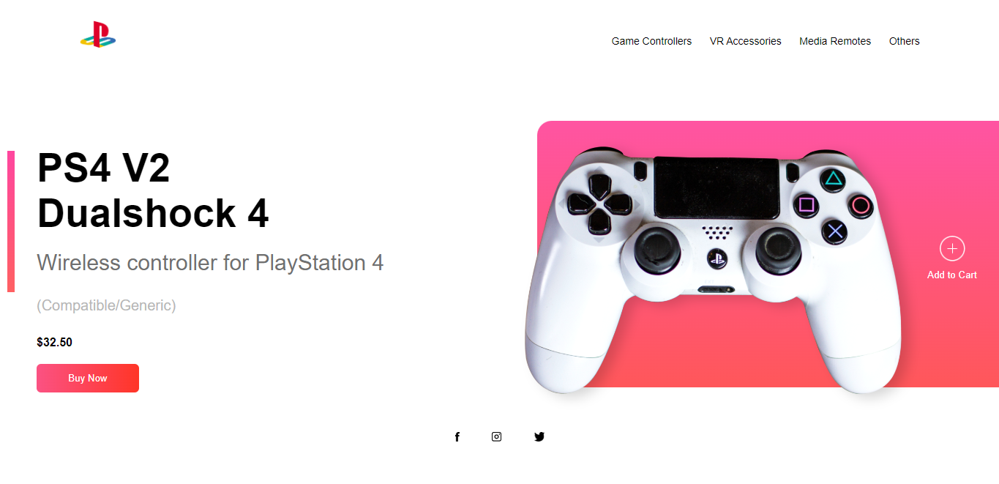
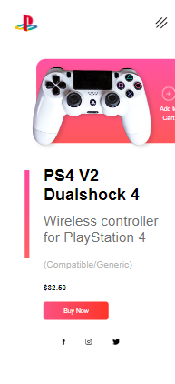

# Proyecto Landing Page Controller PS4
Este Landing Page tiene un diseño prestado del video tutorial - [video de Youtube](https://www.youtube.com/watch?v=lAOkx2yZESY&list=LL&index=49)
La cual me tome el tiempo de adaptarlo a mi filosifia de diseño y manera de hacer el codigo. No quise usar Sass para esta page ya que era algo chico y no requeria mucha funcionalidad o diseño. Me Tomo 5hs hacerlo y tenerlo responsive para distintos dispositivos. 

Esta landing page es ideal para personas que se dedican a vender productos electronicos o calzados y desean usar una page personalizada donde sus clientes aterricen cuando apretan el boton "Ver Mas" de una publicidad. Sinceramente el campo de aplicacion de esta page es inmensa y puede ser adaptada y modificada a los gustos de cualquiera.

En Algunos dias puede tener ajustes o actualizacion de diseño ya que siempre trabajo en paginas hasta dejarlas perfectas.

El menu hambuguesa esta diseñado con CSS3 y Js.

El diseño y estructura de la pagina lo comence en desktop first. 

## Feedback

Si tiene algún comentario, comuníquese conmigo en augustogutierrez8448@outlook.es

## 🛠 Skill 

HTML5, CSS3, JavaScript. 

## Screenshots

### Vista Desktop

### Vista Mobile

